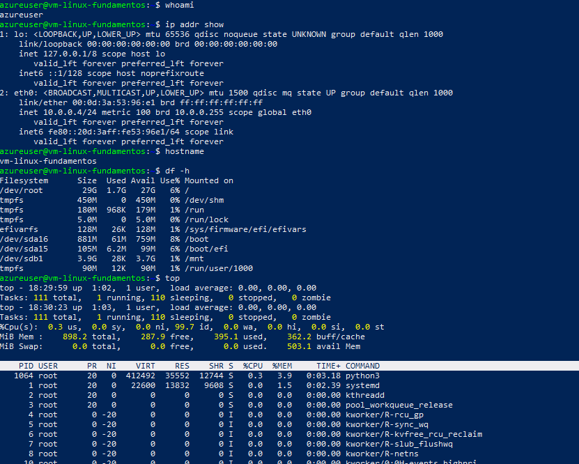
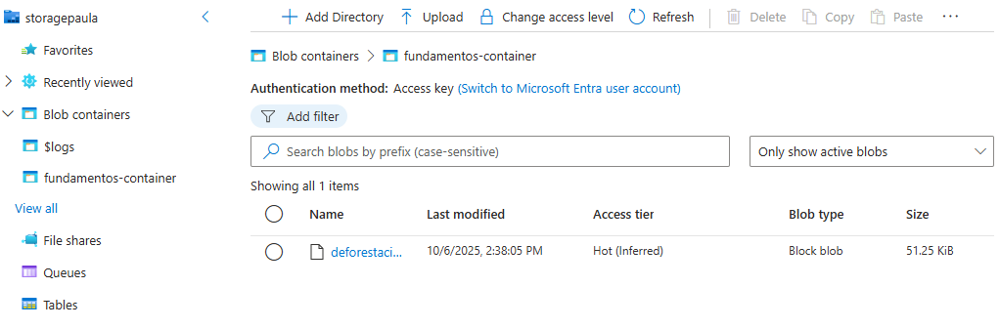

# Fundamentos prácticos en Azure

## Objetivo 
Sentar la base práctica de Cloud:

- Crear y administrar una máquina virtual Linux.
- Configurar una red virtual (VNet) con subredes.
- Subir archivos a Blob Storage y probar el acceso.
- Documentar cada paso con comandos, capturas y notas.

---

## 1. Máquina Virtual (VM)

**Descripción:**  
Aquí se documenta la creación y configuración de la VM.

---

# Fundamentos de Azure ☁️

Este laboratorio documenta la creación y configuración inicial de una máquina virtual en **Azure** usando la suscripción gratuita.

## 1. Creación del Resource Group
Se creó el grupo de recursos `rg-fundamentos` en la región **East US**.


## 2. Creación de la Máquina Virtual
Características principales:

- **Nombre**: vm-linux-fundamentos  
- **SO**: Ubuntu Server 24.04 LTS - Gen2  
- **Tamaño**: Standard B1s (1 vCPU, 1 GiB RAM)  
- **Autenticación**: SSH Key (RSA)  
- **Usuario admin**: `azureuser`


## 3. Conexión vía SSH
Comando usado para conectarse (reemplaza `<public-ip>` por la IP pública real):

```bash
ssh -i vm-linux-fundamentos_key azureuser@<public-ip>
````
---


## 4. Comandos básicos en la VM

Comprobamos la conexión, configuración de red, uso de recursos y procesos activos.

```bash
whoami
ip addr show
hostname
df -h
free -h
top
```

---
.

## 5. Almacenamiento en Azure (Blob Storage)

Se creó un Storage Account y un container para subir archivos de prueba.

- Storage Account: storagepaula
- Container: fundamentos-container

  ## 6. Subida de archivo a Blob Storage desde la VM

Se subió un archivo de prueba `prueba.txt` desde la VM Linux a Azure Blob Storage usando Azure CLI.

```bash
az storage blob upload --container-name fundamentos-container --name prueba.txt --file prueba.txt --connection-string "DefaultEndpointsProtocol=https;EndpointSuffix=core.windows.net;AccountName=storagepaula;AccountKey=gAqxgpf+GRn1KN1n8dnOXPougFHe/3TxSqyoMT+HyJutkL23DdJSzByIr6OW5PThe0EmFbUbwQRk+AStN6M6zw==;BlobEndpoint=https://storagepaula.blob.core.windows.net/;FileEndpoint=https://storagepaula.file.core.windows.net/;QueueEndpoint=https://storagepaula.queue.core.windows.net/;TableEndpoint=https://storagepaula.table.core.windows.net/"
```


