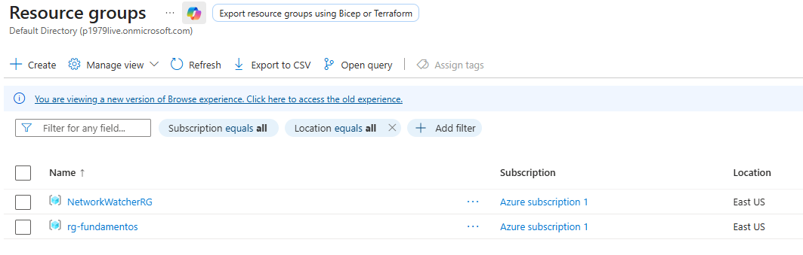
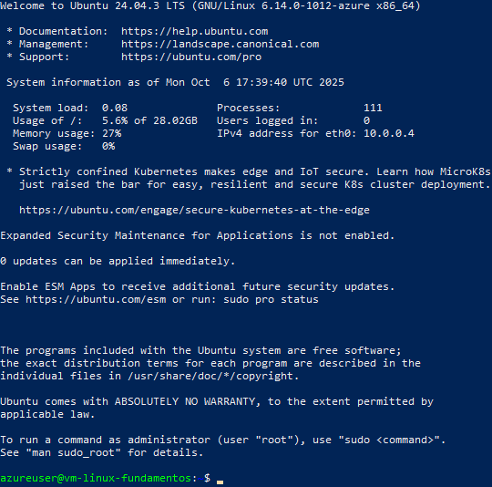

# Fundamentos prácticos en Azure

## Objetivo 
Sentar la base práctica de Cloud:

- Crear y administrar una máquina virtual Linux.
- Configurar una red virtual (VNet) con subredes.
- Subir archivos a Blob Storage y probar el acceso.
- Documentar cada paso con comandos, capturas y notas.

---

## 1. Máquina Virtual (VM)

**Descripción:**  
Aquí se documenta la creación y configuración de la VM.

---

# Fundamentos de Azure ☁️

Este laboratorio documenta la creación y configuración inicial de una máquina virtual en **Azure** usando la suscripción gratuita.

## 1. Creación del Resource Group
Se creó el grupo de recursos `rg-fundamentos` en la región **East US**.



## 2. Creación de la Máquina Virtual
Características principales:

- **Nombre**: vm-linux-fundamentos  
- **SO**: Ubuntu Server 24.04 LTS - Gen2  
- **Tamaño**: Standard B1s (1 vCPU, 1 GiB RAM)  
- **Autenticación**: SSH Key (RSA)  
- **Usuario admin**: `azureuser`


## 3. Conexión vía SSH
Comando usado para conectarse (reemplaza `<public-ip>` por la IP pública real):

```bash
ssh -i vm-linux-fundamentos_key azureuser@<public-ip>

### Captura #2 – Conexión SSH exitosa a la VM Linux


