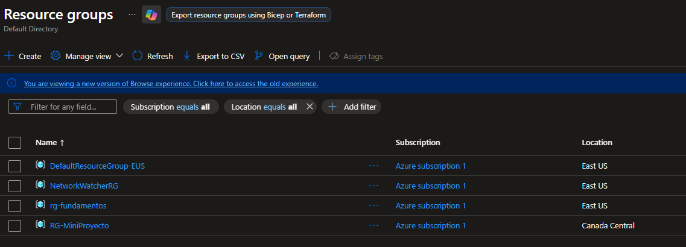
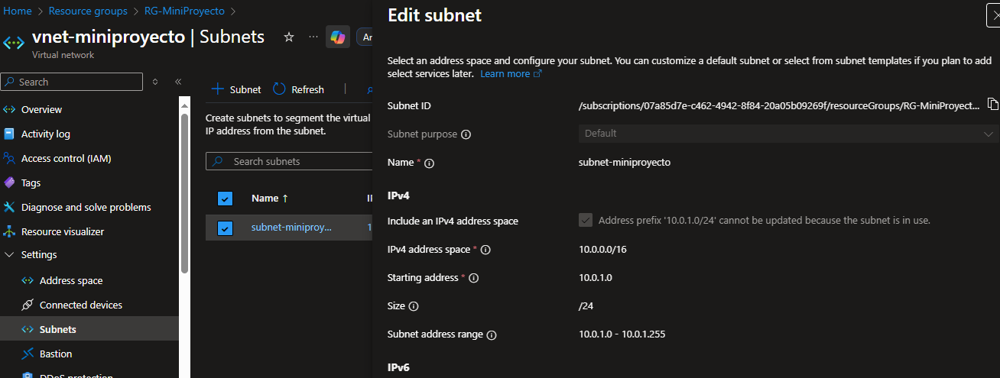
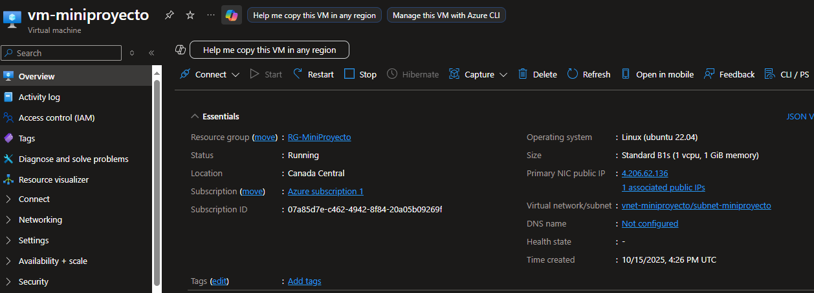
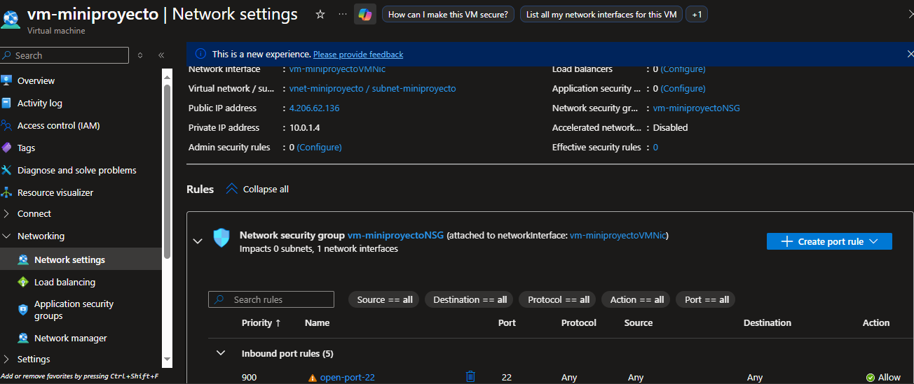
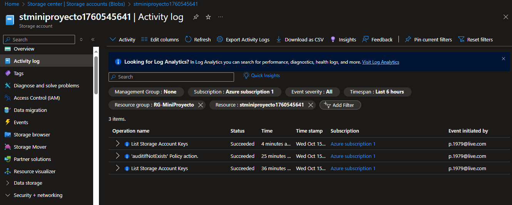
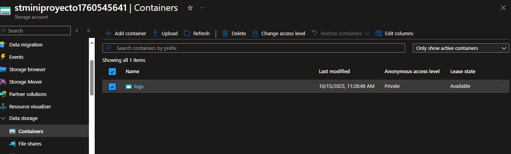

# Mini-Proyecto Azure

Este mini-proyecto integra los conocimientos de VM, redes, almacenamiento, automatización y monitoreo en un entorno funcional en Azure.

## Objetivos

- Crear un Resource Group único
- Desplegar una Red Virtual y subred
- Crear una VM Linux dentro de la subred
- Configurar almacenamiento para logs y datos
- Automatizar tareas mediante scripts
- Implementar monitoreo y alertas
- Documentar todo con capturas y logs


## Scripts y su descripción

| Script | Descripción |
|--------|------------|
| `deploy_network.sh` | Crea Resource Group, Virtual Network y Subnet. |
| `setup_vm.sh` | Despliega la VM Linux con username `paula`, abre puerto 22 y conecta a la subred. |
| `collect_logs.sh` | Crea Storage Account, contenedor `logs` y sube archivos de evidencia (`vm_status.log`). |

## Ejecución de scripts (Azure CLI)

1. Abrir **Azure CLI** o Cloud Shell.
2. Ejecutar scripts en orden:

```bash
bash deploy_network.sh
bash setup_vm.sh
bash collect_logs.sh
````
## Capturas recomendadas (evidencia visual)

  
  
  
  
  

