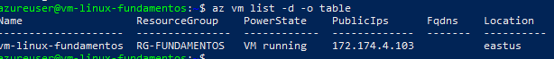

# Administración y Scripting – Azure Cloud Engineer Training

## 🎯 Objetivo
Aprender tareas de administración básica en Azure y comenzar con automatización mediante Azure CLI y scripts.

---

## 1. Verificar estado de la VM

Comando para listar máquinas virtuales en la suscripción:

```bash
az vm list -d -o table
```
.


## 2. Administración básica de la máquina virtual

Durante esta actividad se practicaron las operaciones principales sobre la VM Linux desde **Azure CLI**:

- 🔄 **Reiniciar VM:**
  ```bash
  az vm restart --resource-group rg-linux-fundamentos --name vm-linux-fundamentos

- 🔄 **Detener VM:**
  ```bash
  az vm deallocate --resource-group rg-linux-fundamentos --name vm-linux-fundamentos
  ```
- 🔄 **Encender VM:**
 ```bash
    az login
    az vm start --resource-group rg-linux-fundamentos --name vm-linux-fundamentos
 ```
- 🔄 **Reconexion por SSH:**
 ```bash
    ssh -i vm-linux-fundamentos_key azureuser@<public-ip>
 ``` 
