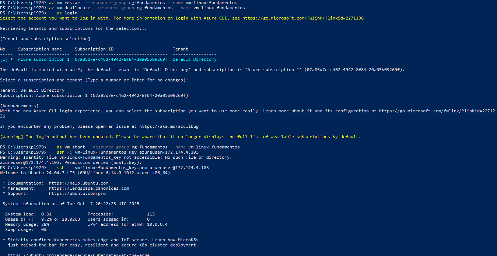
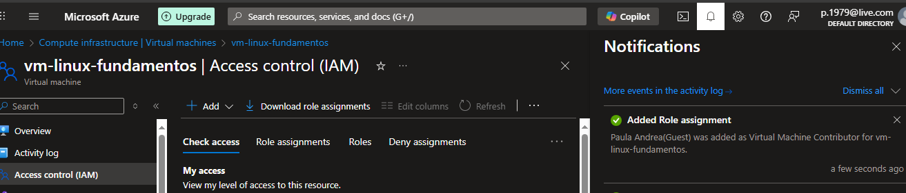
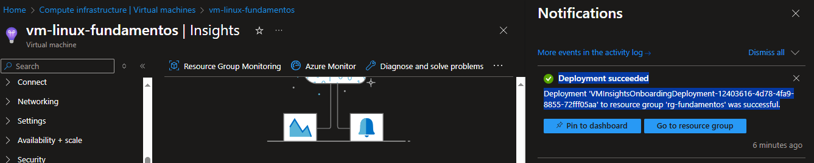
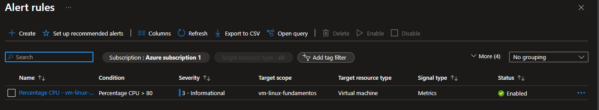

# Administración y Scripting – Azure Cloud Engineer Training

## 🎯 Objetivo
Aprender tareas de administración básica en Azure y comenzar con automatización mediante Azure CLI y scripts.

---

## 1. Verificar estado de la VM

Comando para listar máquinas virtuales en la suscripción:

```bash
az vm list -d -o table
```
.


## 2. Administración básica de la máquina virtual

Durante esta actividad se practicaron las operaciones principales sobre la VM Linux desde **Azure CLI**:

- 🔄 **Reiniciar VM:**
  ```bash
  az vm restart --resource-group rg-fundamentos --name vm-linux-fundamentos

- 🔄 **Detener VM:**
  ```bash
  az vm deallocate --resource-group rg-fundamentos --name vm-linux-fundamentos
  ```
- 🔄 **Encender VM:**
 ```bash
    az login
    az vm start --resource-group rg-fundamentos --name vm-linux-fundamentos
 ```
- 🔄 **Reconexion por SSH:**
 ```bash
    ssh -i vm-linux-fundamentos_key azureuser@<public-ip>
 ``` 
.

## 3. Administración de usuarios y roles

En esta sección se muestra cómo se asignó un rol a un usuario existente para administrar la VM.  
Debido al plan gratuito de Azure AD, no es posible crear nuevos usuarios; se utilizó el usuario de Microsoft asociado a la cuenta del portal.

**Usuario asignado:** p.1xx@live.com  
**Rol asignado:** Virtual Machine Contributor  
**Recurso:** VM `vm-linux-fundamentos`



> Nota: Este rol permite al usuario administrar la máquina virtual (iniciar, detener, reiniciar, modificar configuración), sin otorgar permisos globales sobre Azure AD o la suscripción completa.

## 4. Monitoring y alertas

Se habilitó **VM Insights** para la VM `vm-linux-fundamentos`.  
Azure comenzó a recopilar métricas como CPU, memoria y disco. Los datos estarán disponibles automáticamente después de unos minutos.



## 5. Configuración de alerta para CPU alta

Se creó una alerta para notificar cuando la CPU de la VM `vm-linux-fundamentos` supera el 80%.



6. Script interactivo para administración de la VM

Se creó un script Bash para automatizar tareas básicas de administración desde Azure CLI o WSL.
El script permite iniciar, detener y verificar el estado de la máquina virtual mediante un menú interactivo, y genera un registro de acciones con la fecha y hora de cada operación.

📄 Archivo: scripts/vm_admin.sh

Funciones principales:
Verificar el estado actual de la VM
Iniciar o detener la máquina virtual
Registrar cada acción en vm_actions.log

Ejecución:
./scripts/vm_admin.sh
